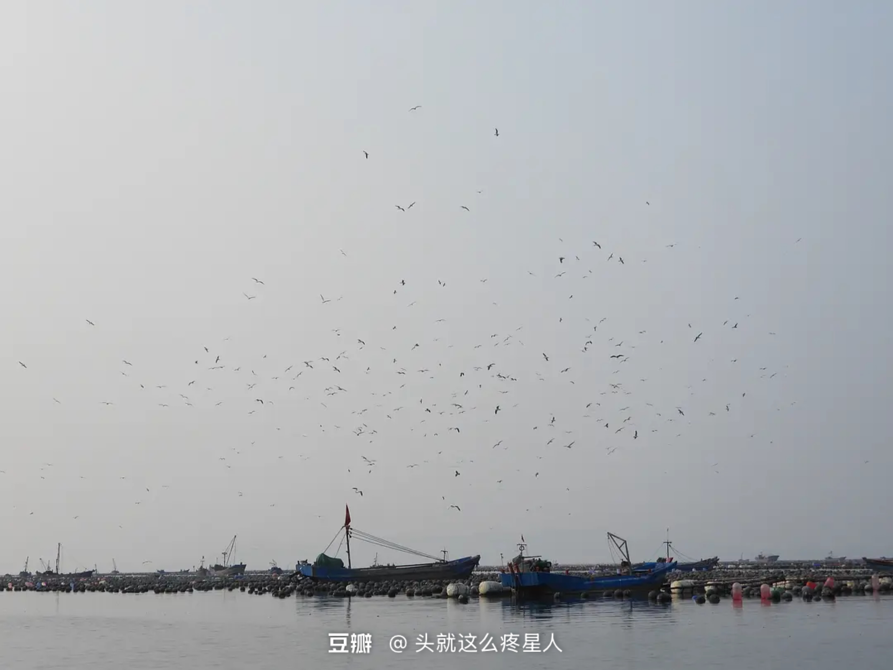
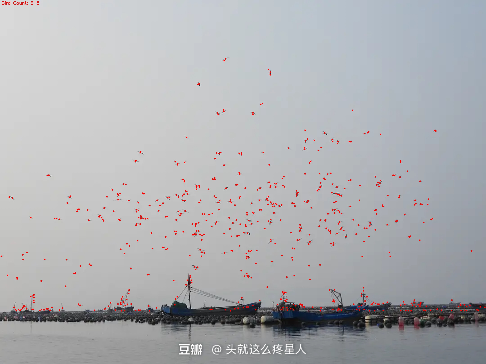
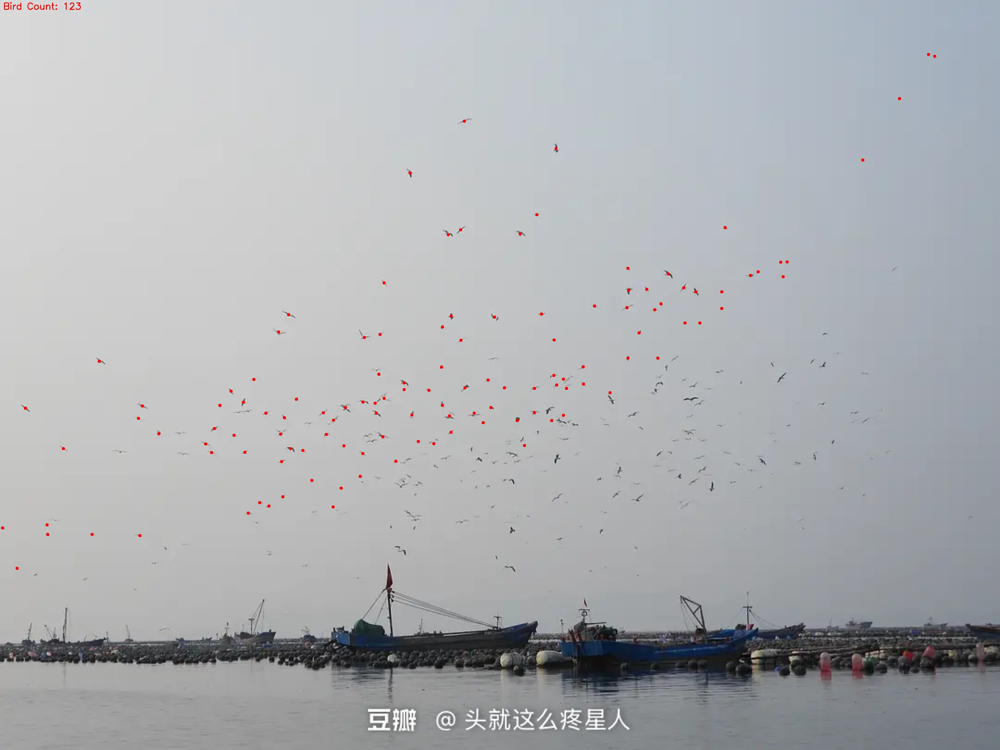

# 飞鸟计数器 (Bird Counter)

这个程序使用OpenCV计算照片中的飞鸟数量，并在结果图像上标记每一只飞鸟的位置。

## 功能特点

- 自动检测天空和地面的分界线，专注于天空区域的鸟类计数
- 使用自适应阈值和形态学操作来增强鸟类检测
- 过滤掉噪点和非鸟类目标
- 在结果图像上用红点标记每只检测到的鸟，并显示总数
- 支持调试模式，显示处理过程中的中间结果
- 支持保存结果图像
- 提供基础和高级两种检测方法
- 支持两种方法的结果比较

## 要求

- Python 3.6+
- OpenCV (cv2)
- NumPy
- Matplotlib (用于可视化)
- scikit-learn (用于高级方法中的聚类)

## 安装依赖

```bash
pip install -r requirements.txt
```

## 使用方法

### 基本方法

```bash
python bird_counter.py path_to_your_image.jpg
```

### 高级方法

高级方法使用更复杂的图像处理技术和聚类算法来处理重叠的鸟类：

```bash
python advanced_bird_counter.py path_to_your_image.jpg
```

### 组合脚本

使用组合脚本可以选择使用哪种方法并进行比较：

```bash
# 使用基础方法（默认）
python bird_count.py path_to_your_image.jpg

# 使用高级方法
python bird_count.py path_to_your_image.jpg --method advanced

# 比较两种方法
python bird_count.py path_to_your_image.jpg --compare

# 调试模式(显示所有处理步骤)
python bird_count.py path_to_your_image.jpg --debug

# 不保存结果图像
python bird_count.py path_to_your_image.jpg --no-save
```

## 算法说明

### 基础方法

程序通过以下步骤处理图像:

1. 读取图像并转换为灰度图
2. 应用高斯模糊减少噪点
3. 分析图像亮度变化，确定天空与地面的分界线
4. 提取天空区域
5. 应用自适应阈值分割，凸显飞鸟轮廓
6. 使用形态学操作清除噪点、增强鸟的轮廓
7. 查找并过滤轮廓，移除太小或太大的对象(噪点或云朵)
8. 计算鸟的数量并在原始图像上标记每只鸟

### 高级方法

高级方法增加了以下技术:

1. 利用多种颜色空间(灰度图和HSV)提取更多特征
2. 使用Otsu自动阈值分割和自适应阈值相结合
3. 应用滑动窗口平滑技术改进天空/地面分割
4. 引入基于形状特征的更精细轮廓过滤(面积、圆度、长宽比)
5. 使用DBSCAN聚类算法处理重叠的鸟类

## 两种方法比较

- **基础方法**: 实现简单，依赖较少，适用于鸟类分布较为分散、与背景对比度高的场景
- **高级方法**: 使用更复杂的图像处理和机器学习技术，在处理重叠鸟类和复杂背景时表现更好，但需要额外的scikit-learn依赖

## 注意事项

- 该程序适用于以天空为背景的飞鸟群照片
- 图像质量和鸟类与背景的对比度会影响检测精度
- 鸟类重叠过多可能导致计数不准确
- 调整轮廓过滤参数可能有助于提高特定图像的检测效果:
  - 基础方法: `min_contour_area` 和 `max_contour_area` 
  - 高级方法: 还可调整 `circularity` 和 `aspect_ratio` 范围

## 输出示例

程序输出包括:
1. 控制台输出鸟的总数
2. 生成一个结果图像，其中每只鸟用红点标记，并显示总数

### 示例图像

#### 原始图像

*一张含有大量飞鸟的原始照片，背景为天空和海港*

#### 基础方法结果

*使用基础方法检测，红点标记了每一只被识别的鸟，共计数618只*

#### 高级方法结果

*使用高级方法检测，处理重叠鸟类并改进形状过滤，可能得到更精确的鸟类计数*

注意：实际检测效果取决于图像的质量、对比度和鸟类在图像中的大小。您可能需要针对特定图像调整参数以获得最佳结果。 